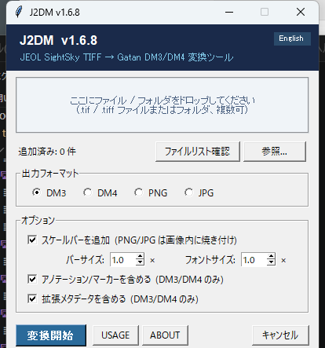
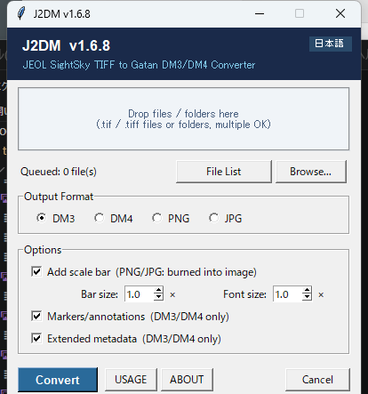

# J2DM — JEOL TIF to DM3/DM4 Converter

> **免責事項:** 本ソフトウェアは無保証で提供されます。本ソフトウェアの使用によって生じたいかなる損害・データの
> 損失・機器の不具合等についても、作者は一切の責任を負いません。「JEOL」「SightSky」「Gatan」
> 「DigitalMicrograph」は各社の商標です。本プロジェクトはJEOL株式会社およびGatan, Inc.(AMETEK)のいずれとも
> 提携・承認関係にはありません。
>
> **Disclaimer:** This software is provided WITHOUT ANY WARRANTY. The author assumes no responsibility for any
> damage, data loss, or equipment malfunction arising from its use. "JEOL", "SightSky", "Gatan", and
> "DigitalMicrograph" are trademarks of their respective owners; this project is not affiliated with or endorsed
> by JEOL Ltd. or Gatan, Inc. (AMETEK).

[日本語](#日本語) ・ [English](#english)

このリポジトリには、[Releases](../../releases) で公開しているビルド済み `.exe` に対応する、ビルドに必要な最小限のソースを配置しています。アーキテクチャなど詳細な技術情報は [NOTES.md](NOTES.md) をご覧ください。
This repository contains a build-minimal source snapshot matching the compiled `.exe` published in [Releases](../../releases). See [NOTES.md](NOTES.md) for further technical details.

---

## 日本語

### 概要

JEOL SightSky TIFF画像(JEOL独自のXMLメタデータが埋め込まれたTIFF)を、Gatan DigitalMicrograph(GMS 3)互換の `.dm3` / `.dm4` ファイルに変換するツールです。実空間画像・回折(逆空間)画像の両方に対応し、スケール・電圧・倍率・コントラストをSightX Viewerの表示に合わせて再現します。

### 使用方法

**GUIで使う場合(通常はこちら — `.exe` をダブルクリックするだけ)**

[Releases](../../releases) から最新の `.exe` をダウンロードし、Windows Explorer上でそのままダブルクリックして
起動すると、常駐型のGUIウィンドウが開きます。コマンドラインは不要で、ほとんどの方はこの方法で使うことに
なります。



- `.tif` / `.tiff` ファイルやフォルダをドロップ欄にドラッグ&ドロップするか、**参照...** ボタンからファイルを
  選択します。**ファイルリスト確認** で現在キューに入っているファイルを確認・編集できます。
- 出力フォーマット(**DM3** / **DM4** / **PNG** / **JPG**)と各種オプション(スケールバー・バーサイズ/
  フォントサイズ・アノテーション/マーカー・拡張メタデータ)を必要に応じて切り替えます。
- **変換開始** をクリックするとバッチ変換が実行されます。完了後、サマリー画面と `J2DM_conversion_log.txt`
  (最初のファイルと同じフォルダに出力)が生成されます。
- **USAGE**・**ABOUT** ボタンからアプリ内のヘルプ・サードパーティライセンス情報を確認できます。右上の
  日本語/Englishボタンでいつでも表示言語を切り替えられます。
- **メタデータを見る** ボタンから、キュー内のファイルが持つJEOLメタデータの全項目(変換に使われる項目だけで
  なく)を確認できます。**保存...**/**すべて保存...** で整形済みテキスト(`.txt`)として書き出せます。

**コマンドラインで使う場合**

Pythonがインストール済みであれば、スクリプトを直接実行することもできます:

```bash
# ファイルを1つ変換
python convert_jeol_to_dm.py /path/to/image.tif

# 複数ファイル・フォルダをまとめて変換(フォルダは再帰的に走査)
python convert_jeol_to_dm.py /path/to/image1.tif /path/to/a_directory /path/to/image2.tif --format dm4 --markers --metadata

# 変換せずにJEOLメタデータの全項目を表示
python convert_jeol_to_dm.py /path/to/image.tif --show-metadata

# ...または整形済みテキストファイルとして出力
python convert_jeol_to_dm.py /path/to/image1.tif /path/to/image2.tif --metadata-out /path/to/output_dir
```

コンパイル済みバイナリも同じフラグを受け付けます(GUIを介さないスクリプト・バッチ処理向け):

```bash
.\J2DM-vX.Y.Z.exe C:\path\to\image.tif --format dm4 --markers --metadata
```

`.tif` ファイルやフォルダを(引数無しで起動する代わりに)`.exe` へ直接ドラッグ&ドロップした場合も、ドロップした
内容が反映済みの同じGUIが開き、そのまま変換に進めます。

### ビルド方法

付属のビルドスクリプトを使うと、専用の仮想環境を作成した上で `PyInstaller` によりスタンドアロン実行ファイルをビルドできます。このリポジトリには、対応する [Releases](../../releases) のビルドに実際に使用した `specs/*.spec` を同梱しています。

Windowsの場合(`build.bat` を実行):

```cmd
build.bat
```

macOS / Linuxの場合(`build.sh` を実行):

```bash
chmod +x build.sh
./build.sh
```

ビルドが完了すると `dist/J2DM-vX.Y.Z.exe` に実行ファイルが生成されます。

*(注意: PyInstallerはクロスコンパイラではありません。Windows用バイナリは必ずWindows上で `build.bat` を、Mac用バイナリは必ずMac上で `build.sh` を実行してビルドしてください。)*

### 技術スタック

- **言語:** Python 3.11+
- **GUI:** `tkinter` / `ttk`(標準ライブラリのみ。追加ランタイム不要でPyInstallerに同梱可能)
- **画像・数値処理:** `numpy`、`tifffile`(JEOL TIFF読み込み・メタデータ抽出)、`Pillow`(PNG/JPG出力・アイコン生成)
- **ドラッグ&ドロップ:** `windnd`(Windows Shell DnDのPython実装)
- **DM3/DM4バイナリ生成:** 自前実装(正規表現バイナリパッチ + ASTベースのタグツリー編集・シリアライザ)。外部のDM3/DM4専用ライブラリには依存しない
- **パッケージング:** `PyInstaller`(`--onefile`。このリポジトリにはビルドに使用した `.spec` のみを同梱)

---

## English

### Overview

Converts JEOL SightSky TIFF images (which embed JEOL's own XML metadata) into Gatan DigitalMicrograph (GMS 3) compatible `.dm3` / `.dm4` files. Supports both real-space (imaging) and reciprocal-space (diffraction) images, reproducing the scale, voltage, magnification, and display contrast seen in SightX Viewer.

### Usage

**Using the GUI (the usual way — just double-click the `.exe`)**

Download the latest `.exe` from [Releases](../../releases) and double-click it in Windows Explorer to open a
persistent GUI window — no command line required. This is how most people will use the tool.



- Drag and drop one or more `.tif`/`.tiff` files and/or whole folders onto the drop zone, or click **Browse...**
  to pick them from a file dialog; **File List** shows/edits everything currently queued.
- Choose the output format (**DM3** / **DM4** / **PNG** / **JPG**) and toggle the options (scale bar, size/font
  scale, markers/annotations, extended metadata) to match what you need.
- Click **Convert** to run the batch. A completion summary and a `J2DM_conversion_log.txt` log (written next to
  the first source file) follow once it finishes.
- **USAGE** and **ABOUT** open in-app help and third-party license info. The 日本語/English button in the top
  right toggles the UI language at any time.
- **View Metadata** shows every JEOL metadata field for the queued files (not just the ones used for
  conversion). **Save...**/**Save All...** export it as formatted `.txt` file(s).

**Using the command line**

If you have Python installed, you can also run the script directly:

```bash
# Convert a single file
python convert_jeol_to_dm.py /path/to/image.tif

# Convert multiple files and/or whole directories in one call (directories are scanned recursively)
python convert_jeol_to_dm.py /path/to/image1.tif /path/to/a_directory /path/to/image2.tif --format dm4 --markers --metadata

# Print every field in the JEOL metadata for a file instead of converting it
python convert_jeol_to_dm.py /path/to/image.tif --show-metadata

# ...or write it out as a formatted .txt per file instead of printing it
python convert_jeol_to_dm.py /path/to/image1.tif /path/to/image2.tif --metadata-out /path/to/output_dir
```

The compiled binary accepts the same flags (useful for scripting/batch jobs where you don't want the GUI):

```bash
.\J2DM-vX.Y.Z.exe C:\path\to\image.tif --format dm4 --markers --metadata
```

Dropping files/folders directly onto the `.exe` (instead of double-clicking it with no arguments) opens the
same GUI pre-populated with what you dropped, ready to convert.

### Building from Source

The provided build scripts create a dedicated virtual environment and use `PyInstaller` to bundle the application and its templates into a standalone executable. This repository includes the exact `specs/*.spec` file used to build the `.exe` published in the corresponding [Releases](../../releases) entry.

On Windows (run `build.bat`):

```cmd
build.bat
```

On macOS / Linux (run `build.sh`):

```bash
chmod +x build.sh
./build.sh
```

The compiled executable will be located at `dist/J2DM-vX.Y.Z.exe`.

*(Note: PyInstaller is not a cross-compiler. Build Windows binaries with `build.bat` on Windows, and Mac binaries with `build.sh` on a Mac.)*

### Tech Stack

- **Language:** Python 3.11+
- **GUI:** `tkinter` / `ttk` (standard library only — no extra runtime needed, bundles cleanly with PyInstaller)
- **Imaging / numerics:** `numpy`, `tifffile` (reading JEOL TIFFs and metadata), `Pillow` (PNG/JPG output, icon generation)
- **Drag-and-drop:** `windnd` (Python binding for Windows Shell drag-and-drop)
- **DM3/DM4 binary generation:** in-house implementation (regex binary patching + an AST-based tag-tree editor/serializer); no dependency on any third-party DM3/DM4 library
- **Packaging:** `PyInstaller` (`--onefile`; only the `.spec` used for this build is included here)
